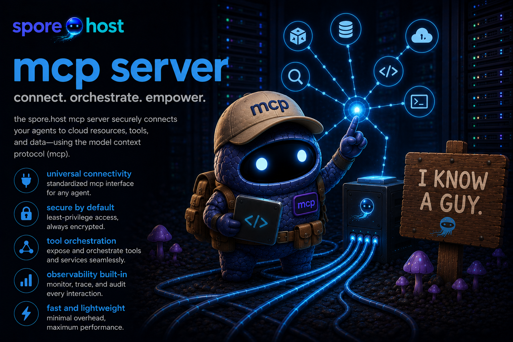

<p align="center">
  
</p>

# spore-host-mcp

[](https://github.com/spore-host/spore-host-mcp/actions/workflows/ci.yml)
[](https://codecov.io/gh/spore-host/spore-host-mcp)
[](https://pkg.go.dev/github.com/spore-host/spore-host-mcp)
[](LICENSE)

MCP server exposing truffle, spawn, and lagotto as tools for AI assistants.

Works with Claude Desktop, Cursor, and any other client that supports the [Model Context Protocol](https://modelcontextprotocol.io).

## Installation

**macOS / Linux (Homebrew)**
```bash
brew install spore-host/tap/spore-host-mcp
```

**Windows (Scoop)**
```powershell
scoop bucket add spore-host https://github.com/spore-host/scoop-bucket
scoop install spore-host-mcp
```

**Direct download** — pre-built binaries on the [releases page](https://github.com/spore-host/spore-host-mcp/releases/latest).

## Setup

Add to your MCP client config:

```json
{
  "mcpServers": {
    "spore-host": {
      "command": "spore-host-mcp"
    }
  }
}
```

For Claude Desktop: `~/Library/Application Support/Claude/claude_desktop_config.json`  
For Cursor: `.cursor/mcp.json`

## Tools exposed

**truffle tools** — EC2 discovery (require AWS credentials; these call the EC2 and Service Quotas APIs):
- `truffle_find` — natural language instance search
- `truffle_spot_prices` — spot prices for an instance type
- `truffle_quota_check` — check EC2 service quotas

**spawn tools** — instance lifecycle (requires AWS credentials):
- `spawn_list` — list instances
- `spawn_status` — instance status, TTL, and absolute reap deadline
- `spawn_stop` — stop a running instance
- `spawn_terminate` — terminate an instance
- `spawn_extend` — extend TTL

**lagotto tools** — capacity watches (require AWS credentials; owner-scoped):
- `lagotto_list` — list your watches (project, owner, status, pattern, regions,
  action, wait-to-acquire / time-to-give-up); optional `project` filter
- `lagotto_status` — full details for one watch id
- `lagotto_watch` — create a `notify` or `hold` capacity watch (`spawn`-action
  watches are deferred to the lagotto CLI, which parses a full launch-config)

**spawn launch tools** — these create real, **billable** EC2 instances, so they
are guardrailed: a **TTL is mandatory** (rejected if absent) and a **`dry_run`**
flag plans without launching. Each tool's description states it is billable.
- `spawn_task_run` — launch a task from a TaskSpec (JSON); `dry_run` sizes the
  cheapest fitting instance and previews the plan. Placement storage (EFS/FSx/
  attached volumes) is deferred to the CLI.
- `spawn_app_launch` — resolve, validate, and **plan** an app launch (application
  / desktop / web) from the catalog. The real DCV/web/session launch is
  intentionally deferred to the human-gated `spawn app launch` CLI.

`spawn_terminate` is **two-phase**: the first call previews the exact instance
that would be destroyed, and only a second call with `confirm=true` actually
terminates it. An ambiguous name (matching more than one instance) is refused —
use the instance ID — so the assistant can never terminate the wrong box.

## Credentials

The server uses your ambient AWS credential chain — the same one the CLIs use
(`AWS_PROFILE`/`AWS_REGION`, `~/.aws/…`, or instance metadata). It also honors
the shared spore.host config base: `SPORE_PROFILE`/`SPORE_REGION` and the
`[spore]` table of `~/.config/spore/config.toml`. No MCP-specific setup is
needed if the CLI already works.

## Documentation

Full setup guide at **[spore.host/docs](https://spore.host/docs/guides/mcp-setup)**.

## License

Apache 2.0 — Copyright 2025-2026 Scott Friedman.
